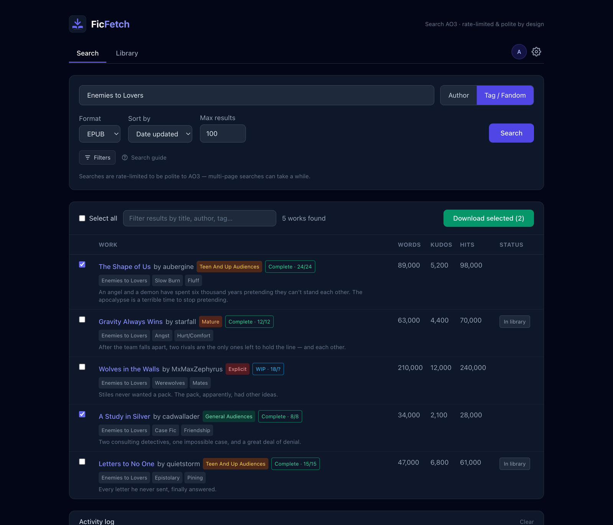

<p align="center">
  
</p>

# FicFetch

A self-hosted web app that searches [Archive of Our Own](https://archiveofourown.org) by author, tag/fandom, or work link, and downloads works as e-books (EPUB, PDF, MOBI, HTML, AZW3) via AO3's own download endpoints. A global rate limiter keeps it polite, and it's built to feed [Calibre](https://calibre-ebook.com/)'s auto-import.

<p align="center">
  
</p>

## Quick start

```bash
cp .env.example .env      # optional — sets paths, port, PUID/PGID, timezone
docker compose up -d --build
```

Open **http://localhost:8067** and sign in. On first run the app creates an `admin` account: set `ADMIN_PASSWORD` in `.env`, or leave it blank and it prints a generated one once to `docker compose logs ficfetch`.

Every setting has a default, so it runs straight after a clone even without `.env`. `.env` is git-ignored, so `git pull` never overwrites your local settings — handy when the same repo runs on a laptop and a NAS.

## Using the app

1. **Search** by author (`missyuki1990`), tag/fandom (`Harry Potter`), or paste a work/chapter URL to grab one story. The **Search guide** panel covers the advanced query operators.
2. Pick a **format** and **sort** order (kudos, hits, word count…), and optionally open **Filters** (complete-only, word-count range, excluded tags).
3. Hit **Search** — results stream into the activity log. Rows show stats and rating/WIP badges, and works you already have are marked **In library**. Click the Words/Kudos/Hits headers to re-sort locally.
4. Tick what you want and **Download selected**. A progress bar and log track each one; duplicates are skipped automatically.

**Library tab** — lists everything downloaded (from `./config/metadata.json`), filterable and sortable. Files still on disk offer **Download** and **Delete**; works Calibre has already imported are marked **Imported** and offer **Forget**, which drops the record so the work can be fetched again.

## Book covers

AO3 works ship as plain text with no cover, so FicFetch renders a graphically pleasing one for each **EPUB** download — centred on the title and author, with colours seeded from the title so every book looks distinct and the same work always produces the same cover. Calibre reads the embedded cover on import, so it becomes the thumbnail on your e-reader.

Each account picks its own look under the avatar menu → **Preferences**: four styles shown as a live preview gallery — **Hybrid** (the default), **Bold gradient**, **Editorial**, and **Generative art** — or **None** to leave the AO3 file untouched. An EPUB that already carries its own cover is never overwritten, and covers apply to new EPUB downloads only. Set `COVER_GENERATION_ENABLED=false` to turn the whole feature off.

## Calibre integration

Point the app's download folder at Calibre's auto-add watch folder and every work flows straight in, tagged `Fanfiction`.

1. In `.env`, set `DOWNLOADS_PATH` to Calibre's watched folder. (Edit `.env`, not `docker-compose.yml`, or `git pull` overwrites it.)
2. In Calibre: **Preferences → Adding books → Automatic adding** → point it at the same folder.

Two defaults make this work, both on:

- **`FLAT_DOWNLOADS=true`** saves files in the folder root — required, because Calibre's auto-add doesn't scan subfolders.
- **`EPUB_TAG=Fanfiction`** embeds the tag in each EPUB's metadata. Calibre reads it on import (via its default "read metadata from file contents"), so no Calibre setup is needed; AO3's own tags import too. Set empty to disable.

`metadata.json` lives in `./config/`, never the watch folder, so Calibre only ever sees e-books there. The app remembers imported works via that file and won't re-download what Calibre already took — use **Forget** in the Library to override. The embedded tag is EPUB-only, so keep EPUB as the format for this workflow.

## Accounts & authentication

Every page and endpoint is behind a login. Two roles: **admin** (full access, including the **System** area) and **user** (search, download, library — no System). Manage accounts under **System → Accounts**; the last admin can't be deleted or demoted.

**First password & recovery**

- Set `ADMIN_PASSWORD` before the first start (read only while the database is empty), or leave it blank for a generated one in the logs.
- Forgot it? Set `ADMIN_PASSWORD_RESET` in `.env`, restart, then blank it again.
- Offline: `docker compose exec --user appuser ficfetch python -m app.adminctl reset-password <user> <pass>`. The `--user appuser` matters — `exec` otherwise runs as root and leaves database files the app can't write.

**SSO (OIDC)** — configure under **System → Settings**, no restart. Works with Authentik, Keycloak, or any OIDC provider: create an app there, copy the **Redirect URI** shown on the page (mind the scheme), then enter the issuer, client ID and secret and enable it. The first SSO login creates a local `user` account — grant admin afterwards. Logout is local only. If you run behind a reverse proxy, read [SSO behind a reverse proxy](#sso-behind-a-reverse-proxy-eg-authentik-on-a-nas) below.

**Security** — over plain HTTP on a LAN the password and session cookie travel in cleartext: fine at home, not on the internet. If you expose the app, use HTTPS and set `SESSION_COOKIE_SECURE=true`. (The default `auto` marks the cookie `Secure` only over HTTPS; forcing `true` on plain HTTP silently breaks login.)

## Configuration

Set via `.env` — see [`.env.example`](.env.example) for the full annotated list. The ones you'll usually touch:

| Variable | Default | Notes |
|---|---|---|
| `DOWNLOADS_PATH` | `./downloads` | Host folder for e-books — point at Calibre's watch folder |
| `CONFIG_PATH` | `./config` | Host folder for the database and metadata |
| `PORT` | `8067` | Web UI port |
| `PUID` / `PGID` | `1000` | Match `id -u` / `id -g` so downloaded files are yours |
| `TZ` | `Europe/Stockholm` | Container timezone |
| `ADMIN_PASSWORD` | — | First-run admin password (blank = generated) |
| `SESSION_COOKIE_SECURE` | `auto` | Set `true` behind HTTPS |
| `FLAT_DOWNLOADS` | `true` | Files in the root (required for Calibre) |
| `EPUB_TAG` | `Fanfiction` | Tag embedded in EPUBs; empty disables |
| `COVER_GENERATION_ENABLED` | `true` | Auto-generate EPUB covers; per-user style under Preferences |

Rate-limit tuning (`AO3_MIN_DELAY`, `MAX_RETRIES`, …) and the internal container paths live in `.env.example`.

## SSO behind a reverse proxy (e.g. Authentik on a NAS)

A common setup: this app and [Authentik](https://goauthentik.io/) both run on your NAS, reached from outside over HTTPS through a reverse proxy. Two things need care — the **redirect URI** and the **issuer URL**.

**1. Tell the app its public URL.** The redirect URI is derived from the incoming request, so behind a TLS-terminating proxy the app otherwise sees `http://` and its internal host. Pin it in `.env`:

```bash
PUBLIC_BASE_URL=https://ao3.example.com
SESSION_COOKIE_SECURE=true
```

`PUBLIC_BASE_URL` fixes the redirect URI to `https://ao3.example.com/auth/oidc/callback` no matter what headers arrive — this is the one that matters. With it set, **leave `FORWARDED_ALLOW_IPS` at its default** (`127.0.0.1`): it then only decides whether logs and the login throttle see the real client IP or the proxy, and pinning it to a specific address is fiddly anyway — when containers are reached through published host ports, uvicorn sees Docker's internal gateway (`172.x.x.x`), not the proxy's LAN IP or your public IP. If you want real client IPs in the logs, set `FORWARDED_ALLOW_IPS=*` (safe as long as the raw app port isn't directly reachable). Then open **System → Settings** and check the Redirect URI shown there reads `https://…` — if it still shows `http://` or an internal host, the above isn't taking effect.

**2. In Authentik**, create an **OAuth2/OpenID Provider** and an **Application**:

- **Redirect URI:** exactly what the Settings page shows — `https://ao3.example.com/auth/oidc/callback`.
- Note the **Client ID**, **Client secret**, and the provider's **issuer URL** (Authentik shows it as `https://auth.example.com/application/o/<app-slug>/`).

**3. In the app** (System → Settings), enter that **issuer URL**, the client ID and secret, tick **Enable SSO**, and save.

**Use the external issuer URL even though Authentik is local.** The app fetches discovery, tokens and signing keys server-side, and it checks that the token's `iss` matches the issuer you entered — and Authentik stamps `iss` with its *external* URL. An internal shortcut like `http://authentik:9000/…` would fail that check. So the app's container must be able to reach `https://auth.example.com`; on some NAS setups that means split-DNS or hairpin NAT, and if discovery fails this is usually why.

Once saved, a **Log in with SSO** button appears on the login page, and the first SSO login creates a `user`-role account you can promote under Accounts.

## Notes & limitations

- **Polite by design:** 3–6 s between every AO3 request, with `Retry-After`/backoff on 429s. Large searches are intentionally slow — that's the point.
- **Public works only** — restricted works are skipped.
- **Single process:** the rate limiter and job queue live in one process, so never run uvicorn with `--workers N`. The queue is in-memory; a restart mid-job loses it, but files persist and dedup makes re-running cheap.
- **File ownership:** the container starts as root only to apply `PUID`/`PGID`, then drops to an unprivileged user via `gosu`. To skip that, set `user: "1000:1000"` in compose.
- **Tailwind via CDN:** the UI needs internet at page load; vendor a built CSS file into `app/static/` for fully offline use.

## API

Behind the same session cookie as the UI:

- `POST /api/search`, `POST /api/download`
- `GET /api/downloads`, `GET`/`DELETE /api/downloads/{category}/{filename}`
- `GET /api/cover-preview/{style}` — sample cover JPEG for the Preferences gallery
- `GET /api/events` — SSE stream (log, progress, item_done, job_done)

## Respect creators

For **personal archiving** of works you can access. Respect [AO3's Terms of Service](https://archiveofourown.org/tos) and creators' wishes, and keep the rate limits generous — AO3 is a donation-funded nonprofit.

## License

GPL-3.0 © 2026 Henrik Engström — see [LICENSE](LICENSE).
